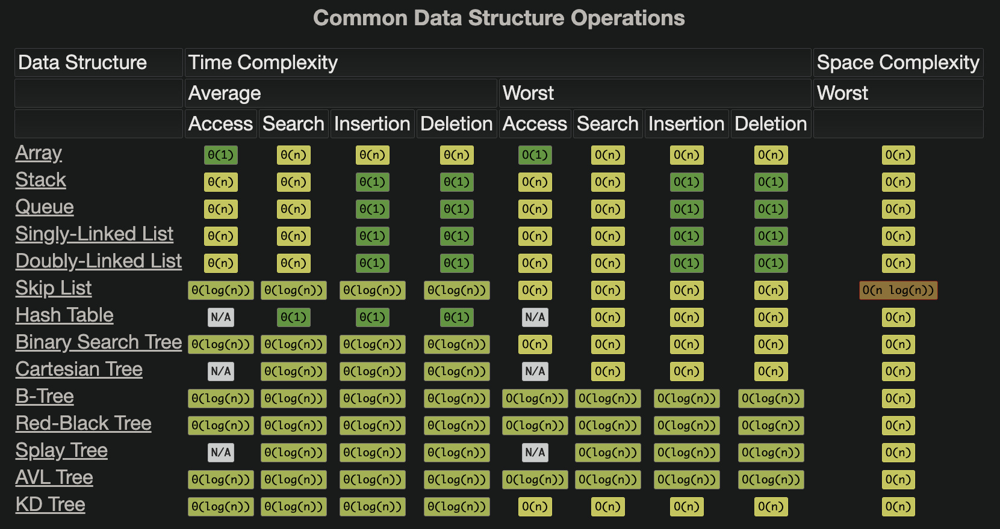
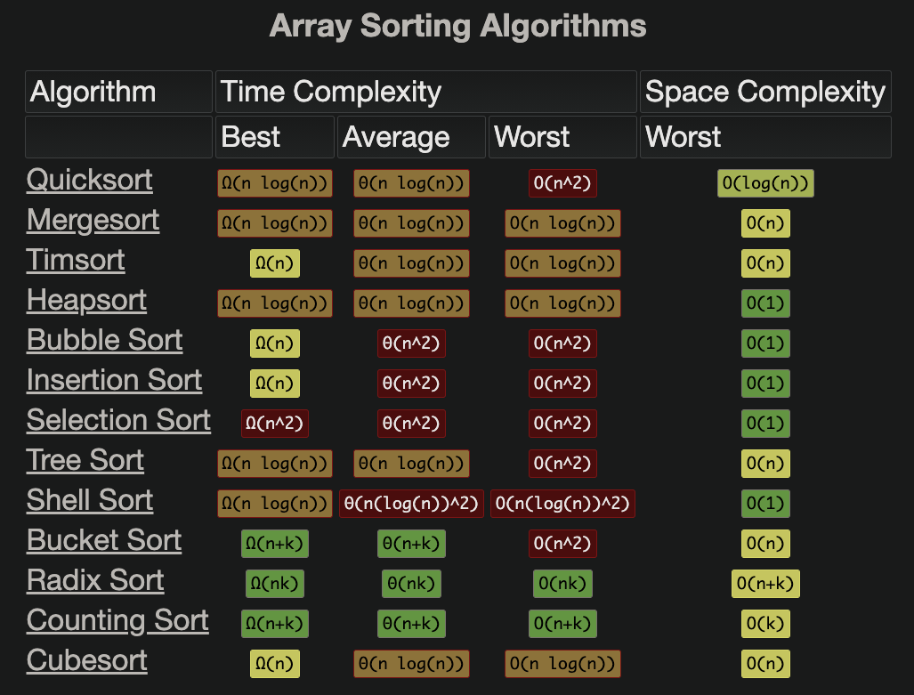

### Java Collections Framework
* Collection is parent interface --> Sets and Lists ; Maps Interface does not follow Collection
* LinkedList class is both a List and a Queue as it implements both interface
* All single-element collections implement the Collection interface, sets and lists and not Maps
*  `LinkedHashMap` has all the properties of a HashMap, quick lookup on a key, it also preserves the order of entry into the map.
* for any serious use of a Map interface in a parallel environment, use `ConcurrentHashMap`

#### Arrays / ArrayList ->
* Random access , direct access by memory calculation (mem ref + Data type * index)
* great for fixed length/elements with no/fewer updates/deletes
* updates and deletes would need array copy (System.arraycopy()) and reconstruction
* ArrayList internally uses Array for implementation
* StringBuffer - is mutable unlike string and is thread safe / synchronized.
* StringBuilder - is mutable and is not thread safe so gives better performance when multi threads are not used.

    
#### Linked List (Singly / Doubly) ->
* Linked List is better for frequent updates/deletes/extension of list
* Its a Recursive datatype
* traverse through length to get element
* add/update/delete without reshuffling whole list

#### Queue / Deque ->
* Queue - FIFO, add, remove, peek (move next without removing),
* Deque - known as double ended queue add/remove from both ends, can act as both FIFO as well as LIFO (like stack) 
* priority queue, where each element is assigned a priority and enqueued according to this priority
* In java Deque is preferred over stack 

#### Stack
* LIFO
* old API class and concrete impl without interface
* extends vector (old api)
* syncronized so slow

#### Maps (Hash, Associative array, dictionary)
* A map is a key-value mapping, which means that every key is mapped to exactly one value
* Map implementations - `HashMap, TreeMap, Hashtable and LinkedHashMap`
* HashMap internally uses arrays and is not ordered and not Synchronized
* HashTable is same as HashMap but is Synchronized, this is deprecated and should not be used
* TreeMap uses BST internally and is ordered
* LinkedHashMap same as hashmap with O(1) search and preserves insertion order
* ConcurrentHashMap - thread safe and should be used instead of HashTable
* Each node in tree is a key value pair
* In case of hash collision, can use secondary hash fn and value can be used as an offset

#### Sets 
* set is simply a group of unique things, it is Unordered set of elements with no duplicates
* Set interface implementation: **HashSet, TreeSet and LinkedHashSet** (All allow unique elements only, are NOT synchronized)
* HashSet uses hashmap as implementation, key is the element and value is stored as a marker, Use HashSet if you don’t want to maintain any order of elements.
* Use LinkedHashSet if you want to maintain insertion order of elements, it internally uses Map and Linked List 
* Use TreeSet if you want to sort the elements according to some Comparator
* Collections.newSetFromMap returns a Set from Map
 
#### Graphs
* data structure for storing connected data in a **network model**
* consists of vertices and edges. A vertex represents the entity (for example, people) and an edge represents the relationship between entities
* If these edges feature a direction in them, the resulting graph is known as a directed graph
* If  these edges carry relative weight, this graph is known as a weighted graph.
* it can be uni or bidreictional, can have loops 

##### Graph Representations - Adjacency Matrix and Adjacency List
* adjacency matrix is a square matrix with dimensions equivalent to the number of vertices in the graph, matrix typically have values ‘0’ or ‘1’. value of ‘1’ indicates adjacency between the vertices in the row and column and a value of ‘0’ otherwise
* An **adjacency matrix is often implemented as a two-dimensional array** where all nodes appear on each dimension of the array, thus forming a matrix. easy to implement and efficient to query, but takes more space 
* An **adjacency list is simply an array of lists**, which are lists of edges between nodes in a graph. hard to create and less efficient to query but takes less space
* An adjacency list takes O(n) time to check whether an edge exists because you potentially must iterate over all elements in the list to check for the existence of an edge.

##### Graph Traversal 
- depth-first traversal (using Stack LIFO) 
- breadth-first traversal (using Queue FIFO).

* Java doesn’t have a default implementation of the graph data structure, we can implement them using existing collections, Map<Vertex, List<Vertex>>
* JGraphT is one of the most popular libraries in Java for the graph data structure. It allows the creation of a simple graph, directed graph, weighted graph, amongst others.
* Apache Giraph, currently used at Facebook to analyze the graph formed by their users, and Apache TinkerPop, commonly used on top of graph databases.

#### Trees:
* Tree is a Minimally connected Graph with no loops, its a non-linear data structure where data objects are organized in terms of hierarchical relationship.
* Unidirectional, one root node, only one parent, tree is hierarchical 

##### Binary trees with two childrens
* **BST** : binary search tree, less left, eq/more right
* **Binary Heap Tree** : Children are more than parent, binary tree
* **Red & Black Tree** : 
  * Java tree API implementation is an instance of this data structure, it is a kind of self-balancing binary search tree
  * Each node is either red or black, The root is black, All leaves are black, If a node is red, then both its children are black.
* Java Trees - TreeSet and TreeMap (only 2)

##### Tree Traversal
* breadth-first search typically uses a Queue (FIFO) to keep track of nodes, whereas a
* depth-first search typically uses a Stack (LIFO)
* There are three types of depth-first traversal:
    - pre-order (parent first): visit the parent, then all the left children, and then all the right children.
    - in-order (parent mid): visit the left child, then the parent, and then the right child. This approach is useful for BSTs as it traverses the nodes in sorted order.
    - post-order (parent last): visit the left child, then the right child, and then the parent.

### Sorting:
Comparable - natural ordering, example Arrays.sort(), String class.
Comparator - controlled custom impl - Collections.sort(list, ComparatorIMPL)

Core Algos : (BIQM) Bubble - Insertion - Quick - Merge

1. Bubble Sort avg O(n2)
    * input `array` of ints
    * iterate thru all elements and compare with I+1 (next element)
    * two loops 

2. Insertion Sort O(n2):
    * create temp `sorted linked list`
    * two loops as usual
    * compare each new input number from right to left on sorted list number and at right position
    * if not less then any sorted list element then add at end of Linked List

3. Quick Sort - avg O(nlogn):
	* Divide n conquer algo
	* Pivot anywhere mostly in middle or end/right, lower list adds < pivot  and higher list add >= pivot
	* Recursively call function for all lower list.
	* Add pivot 
	* Recursively call function for all higher list

#### Searching:

Binary Search - O(log n):
   * Needs a Sorted list as input
   * break it from middle of list
   * match element at middle if less then recursively call function with lower list else with higher list
   * return true when match found or false when list is empty or null

