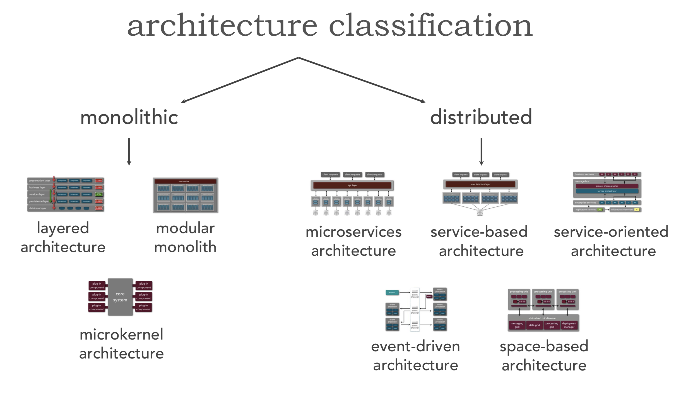
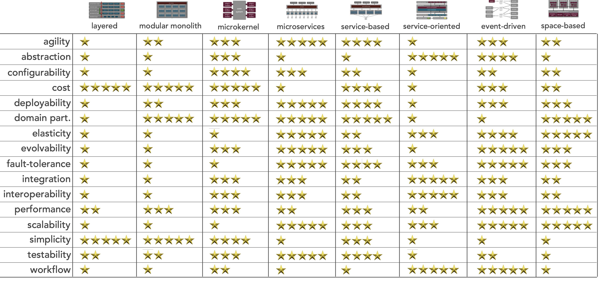
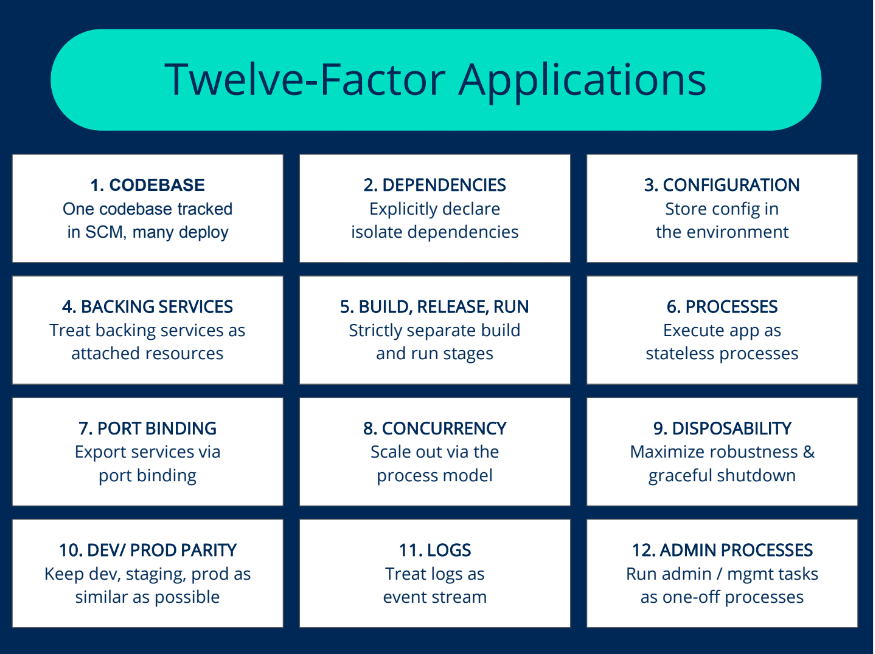

####  SOA 
  Application components provide services to other components via a communications protocol over a network. The communication can involve either simple data passing or it could involve two or more services coordinating connecting services to each other. it uses Enterprise Service Bus (ESB) which is a style of the integration architecture that allows communication via a common communication bus that consists of a variety of point-to-point connections between providers and consumers . In addition to above, the data storage is shared within all services in SOA (Same DB)

#### Microservice (MS) vs SOA:
- SOA is ESB dependent and can be single point of failure (SPOF)
- No noisy neighbour problem with MS while SOA does
- Size and Scope is main diff, SOA can be either a monolith or it can be comprised of multiple microservices
- MS has synchronous calls which introduce real-time dependencies, resulting in a loss of resilience. It may also cause latency, which impacts performance
- SOAs operate more slowly than microservices architectures, which minimize sharing in favor of duplication.

#### Service-Based Architecture (Macro Service):
- Service-based architectures limit the number of network calls by grouping much larger chunks of code together by domain. 
- This should result in better performance. What might have been a call graph of a dozen related microservices becomes method calls within a single service.
- A service-based architecture provides more delivery speed than a monolith or service-oriented architecture (SOA) by breaking the code apart in the domain-centric way advocated by microservice and DDD proponents
- It decreases the testing surface to a single component to be released belonging to a single domain 

#### CQRS - Command Query Responsibility Segregation with Event Sourcing

Consistency
- Command – can be implemented with strong consistency in the write model
- Query – can be eventually consistent in the read model

Data storage
- Command – storage optimized for writing, e.g. normalized form
- Query – storage optimized for reading, e.g. reduce joins with denormalized form

Scalability
- Command – mostly low scalability requirements, because writes are few compared to reads
- Query – most of the operations in a typical system are reading data

Pointers:
- CQRS introduces complexity, which makes changing the system more difficult. This makes sense only if you have some ridiculous performance problems, which are solved better with two data models, instead of one. Most applications do not fall into this category.
- It could be, that CQRS is a match for you. However, have you tested a simpler approach first? Do you have some numbers, which prove, that a traditional relational database will not be sufficient? You will be surprised how well an RDBS can scale, without your users noticing any delay.
- Eventual consistency is a problem, which you cannot avoid. Furthermore, whether eventual consistency is a deal-breaker, is decided by the business people, not by you.
- **Event-sourcing**: Try with one data model first. Write the events (the write part) and their projections (the read part) in the same model. If one model does not work for you, then move on to two models. As said, you will be surprised how far you can go with a simple RDBS. There is a reason, they are still around.
- Scalability Requirements: You must prove that you have a performance problem first. Have you tried using one model? Do you have numbers, which point to performance problems? Or are you building a Twitter architecture for your small proof of concept application?
- Most people, who apply this pattern, hope to improve the design of their system and make it easier to maintain. This is a huge misunderstanding about the advantages and disadvantages of this architecture. CQRS is to be used with extreme caution because there are very few use-cases, where it solves more problems than it creates.

#### Choreography-based SAGA 
- No central coordinator exists in this case. Each service produces an event after completion of its task and each service listens to events to take an action. This pattern requires an mature event-driven architecture.
- **Event Sourcing** is an approach to store the state of event changes by using an Event Store. Event Store is a message broker acting as an event database. States are reconstructed by replaying the events from the Event Store.
- Choreography-based SAGA pattern can work well for small number of steps in a transaction (e.g. 2 to 4 steps). When number of steps in a transaction is increasing, it is difficult to track which services listen to which events.

#### Orchestration-based SAGA: 
- A coordinator service (Saga Execution Orchestrator, SEG) is responsible for sequencing transactions according to business logic. 
- Orchestrator decides to which operation should be performed. If an operation fails, Orchestrator undo the previous steps. It is called as compensation operation. Compensations are the actions to apply when a failure happens to keep the system in consistent state.
- Undoing changes may not be possible already when data has been changed by a different transaction.
- Compensations must be idempotent because they might be called more than once within the retry mechanism.
Compensations should be designed carefully.

#### SAGA design considerations 
1. Avoid using distributed transactions across microservices if possible. Working with distributed transactions brings more complex problems.
2. Design your system that doesn’t require distributed consistency as much as possible. To achieve this, identify transaction boundaries as following;
   - Identify the operations that have to work in same unit of work. Use strong consistency for this type of operations
   - Identify the operations that can able to tolerate possible latencies in terms of consistency. Use eventual consistency for this type of operations
3. Consider using event-driven architecture for asynchronous non-blocking service calls
4. Design fault-tolerant systems by compensations and reconciliation processes to keep the system consistent
5. Eventual consistent patterns requires a change in mindset for design and development

#### EDD Event Driven Design
An event-driven architecture is made up of event producers and event consumers, its async and loosely coupled because event producers don’t know which event consumers are listening for an event, and the event doesn’t know what the consequences are of its occurrence.

##### Pub/sub model
This is a messaging infrastructure based on subscriptions to an event stream. With this model, after an event occurs, or is published, it is sent to subscribers that need to be informed.

##### Event streaming model
With an event streaming model, events are written to a log. Event consumers don’t subscribe to an event stream. Instead, they can read from any part of the stream and can join the stream at any time. 

1. **Consume and Project** -> publish to Kafka and subscriber reads and wrties to a DB to provide an eventual consistency
2. **E2E Event Driven** -> publish to kafka, subscriber to kafka and notify back to consumer via websocket/hooks (no pollling from client, we push them when we are done
3. **In Memroy K:V Pair** -> Publish to kafka (compated topic), subscriber reads and update the inmemory K:V store, so lookups have 0 latency (being inmemory) and can also have a persisted backup storage on Kafka (Compated topic which ensure at least latest value of keys are not deleted)
4. **Schedule and Forget** -> Scheduler to publish to kafka and a subscriber async processes it with retry and exponential backoff to gurantee eventaul processing and also ensure sequential / ordered processing (with in same partition)
5. **Events in transaction** -> 
   1. Kafka support idempotence with newer version and can be used to support exactly once delivery **(enable.idempotence=true)**
   2. Kafka also support a new **atomic transaction API** which can be used to write a batch of events into kafka multi partitions in a way that either all are written successfully or none, consumer can also read all those events as a single transaction, making an end to end exactly once semantics.

#### Which Services Arch fits your needs:

#### 12 Factor App:

#### OOPs SOLID Principles:
* Single Responsibility Principle - (SRP) states that a class should have exactly one responsibility
* Open/Closed Principle - class (or function) should be open for extension but closed for modification
* Liskov Substitution Principle - LSP states that if type S inherits from type T then both T and S should be interchangeable in functions that expect T.
* Interface Segregation Principle - It says to avoid writing monstrous interfaces that burden classes with responsibilities they don't need or want. 
* Dependency Inversion Principle - Instead of writing code that refers to actual classes, you should instead write code that refers to interfaces or perhaps abstract classes

#### DRY - Dont Repeat Yourself!

#### KISS - Keep It Simple Stupid!

#### Conways Law: 
Any organization that designs a system (defined broadly) will produce a design whose structure is a copy of the organization's communication structure. The law is based on the reasoning that in order for a software module to function, multiple authors must communicate frequently with each other. Therefore, the software interface structure of a system will reflect the social boundaries of the organizations that produced it, across which communication is more difficult. 

#### DDD Domain Driven Design
- Domain-driven design (DDD) is the concept that the structure and language of software code (class names, class methods, class variables) should match the business domain
- DDD proposes to align business and technical concerns through analysis of the business domain, modeling of the problem domain—the problems that should be solved by the software—and making design decisions according to the model of the problem domain. It provides tools for making design decisions on two levels: strategic and tactical.
- Domain-driven design proposes a better way of getting the knowledge from domain experts to software engineers—using a **ubiquitous language**.
  
- **Strategic Design** patterns and practices provide a framework for analyzing a company’s business domain and distilling the software’s problem domain—i.e., *what problems should be solved* or addressed by the software.The strategic tools also provide a robust framework for making **high-level architectural** decisions, including tasks such as decomposing a system into modular components and mapping the interaction patterns between them.

- **Tactical Design** patterns support making **low-level design** decisions relating to the implementation of the system’s components and their business logic, The goal of tactical design is to architect the solution so that it *fits the problem domain as closely as possible*.

- Domains -> Business Domain, Subdomain (Core, Generic, Supporting)

##### DDD Building Blocks
- Entity (Diff POJO)
An object that is not defined by its attributes, but rather by a thread of continuity and its **identity**.
- Value object (POJO Instance)
A value object is an object that contains attributes but has no conceptual identity. They should be treated as immutable.
- Aggregate (Inheritance OOPs)
A group of objects that are bound together by a root entity: the aggregate root. Objects outside the aggregate are allowed to hold references to the root but not to any other object of the aggregate. The aggregate root is responsible for checking the consistency of changes in the aggregate.
- Domain Event
A domain object that defines an event (something that happens). A domain event is an event that domain experts care about.
- Service
When an operation does not conceptually belong to any object. Following the natural contours of the problem, you can implement these operations in services. 
- Repository
Methods for retrieving domain objects should delegate to a specialized Repository object such that alternative storage implementations may be easily interchanged.
- Factory
Methods for creating domain objects should delegate to a specialized Factory object such that alternative implementations may be easily interchanged.

#### CAP / Brewer's theorem 
It is impossible for a distributed data store to simultaneously provide more than two out of the following three guarantees:
- **Consistency**: Every read receives the most recent write or an error
- **Availability**: Every request receives a (non-error) response, without the guarantee that it contains the most recent write
- **Partition tolerance**: The system continues to operate despite an arbitrary number of messages being dropped (or delayed) by the network between nodes

When a network partition failure happens should we decide to:
- Cancel the operation and thus decrease the availability but ensure consistency
- Proceed with the operation and thus provide availability but risk inconsistency

The CAP theorem implies that in the presence of a network partition, **one has to choose between consistency and availability.**

CAP is frequently misunderstood as if one has to choose to abandon one of the three guarantees at all times. In fact, the choice is really between consistency and availability only when a network partition or failure happens; at all other times, no trade-off has to be made.

- Database systems designed with traditional ACID guarantees in mind such as **RDBMS choose consistency over availability**
-  systems designed around the BASE philosophy, common in the **NoSQL choose availability over consistency**
-  Blockchain technology sacrifices consistency for availability and partition tolerance, but is achieved through validation among the nodes over time with the resulting impression that the theorem is not valid.

#### BASE (Basically Available, Soft State, Eventual Consistency)
Eventual consistency is a consistency model used in distributed computing to achieve high availability that informally guarantees that, if no new updates are made to a given data item, eventually all accesses to that item will return the last updated value. Its also called optimistic replication, is widely deployed in distributed systems, A system that has achieved eventual consistency is often said to have converged, or achieved replica convergence.
- **Basically Available**: basic reading and writing operations are available as much as possible (using all nodes of a database cluster), but without any kind of consistency guarantees (the write may not persist after conflicts are reconciled, the read may not get the latest write)
- **Soft state**: without consistency guarantees, after some amount of time, we only have some probability of knowing the state, since it may not yet have converged
- **Eventually consistent**: If the system is functioning and we wait long enough after any given set of inputs, we will eventually be able to know what the state of the database is, and so any further reads will be consistent with our expectations

#### Conflict resolution for distributed data/systems
In order to ensure replica convergence, a system must reconcile differences between multiple copies of distributed data. This consists of two parts:

- exchanging versions or updates of data between servers (often known as anti-entropy)
- choosing an appropriate final state when concurrent updates have occurred, called reconciliation.
- A widespread approach is "last writer wins". Another is to invoke a user-specified conflict handler. Timestamps and vector clocks are often used to detect concurrency between updates. Some people use "first writer wins" in situations where "last writer wins" is unacceptable.

Reconciliation of concurrent writes must occur sometime before the next read, and can be scheduled at different instants:

- Read repair: The correction is done when a read finds an inconsistency. This slows down the read operation.
- Write repair: The correction takes place during a write operation, if an inconsistency has been found, slowing down the write operation.
- Asynchronous repair: The correction is not part of a read or write operation.

#### CRDT - conflict-free replicated data type
In distributed computing, a conflict-free replicated data type (CRDT) is a data structure which can be replicated across multiple computers in a network, where the replicas can be **updated independently and concurrently without coordination between the replicas**, and where it is always mathematically possible to resolve inconsistencies that might come up. The NoSQL distributed databases Redis, Riak and Cosmos DB have CRDT data types.

 CRDT is ideal for optimistic replication as concurrent updates are allowed to go through, with inconsistencies possibly created, and the results are merged or "resolved" later. In this approach, consistency between the replicas is eventually re-established via "merges" of differing replicas. it is mathematically always possible to merge or resolve concurrent updates on different replicas of the data structure without conflicts. 

