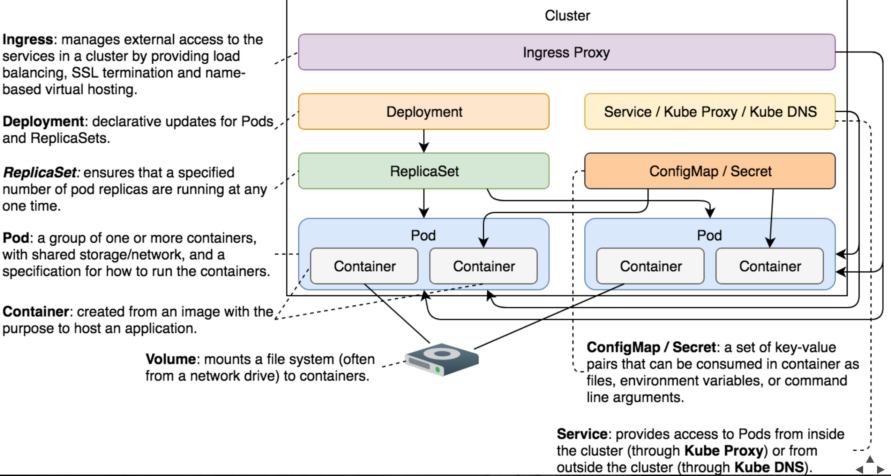

## Docker Images
  
 - Immutable   
 - Everything the service needs (but not more)   
 - Inside a Docker registry
-   Docker's Multi-Stage Builds
-   Allows execution of multiple stages while maintaining small size of the final image
-   We run unit tests and we built the application binary
-   The result of the first stage (the binary) was used in the final stage to assemble the image
- Push the built image to a docker registry

##### Microservices on Kubernetes and Docker:
- Docker hosts the API bundle as docker file / images
- Kubernetes manages docker images to create a highly scalable cluster of PODS, it orchestrates the life and times of individual Docker containers, giving us the primitives we need to construct robust and scalable systems.
- It has many features which are especially useful for applications running in production, like service naming and discovery, load balancing, application health checking, horizontal auto-scaling, and rolling updates.
- MiniKube is the software you can install to have Kubernetes on local mac, You can create a minikube cluster of multiple pods within which will be all images of a provided docker image file
- API Gateway can be created by using ambassador or Ingress on Kube	 

## Kubertnetes 

### MiniKube

- Install minikube + Basic commands:

 `` minikube start --vm-driver virtualbox --cpus 4 --memory 4096
    minikube status
    minikube dashboard
    minikube docker-env
    eval $(minikube docker-env)
    docker container ls``
    
    
    minikube ssh
    docker container ls
    exit
    kubectl config current-context
    kubectl get nodes
    minikube stop
    minikube start
    minikube delete`

    
### Istio 

##### ServiceMesh – Kubernetes, Istio, Conduit, Envoy and Consul

###### Features:		
- Load balancing
- Fine-grained traffic policies
- Service discovery
- Service monitoring
- Tracing
- Routing
- Secure service to service communication
    
###### Implementations:        
- Conduit is a service mesh based on Go and Rust for proxying
- Istio is also a service mesh based on Go, it uses	Envoy Proxy for Data plane, Istio (Pilot, Mixer and Citadel) for Control plane
- Consul can also act as control plane with Envoy proxy as Data plane it can create a very flexible and powerful servicemesh

