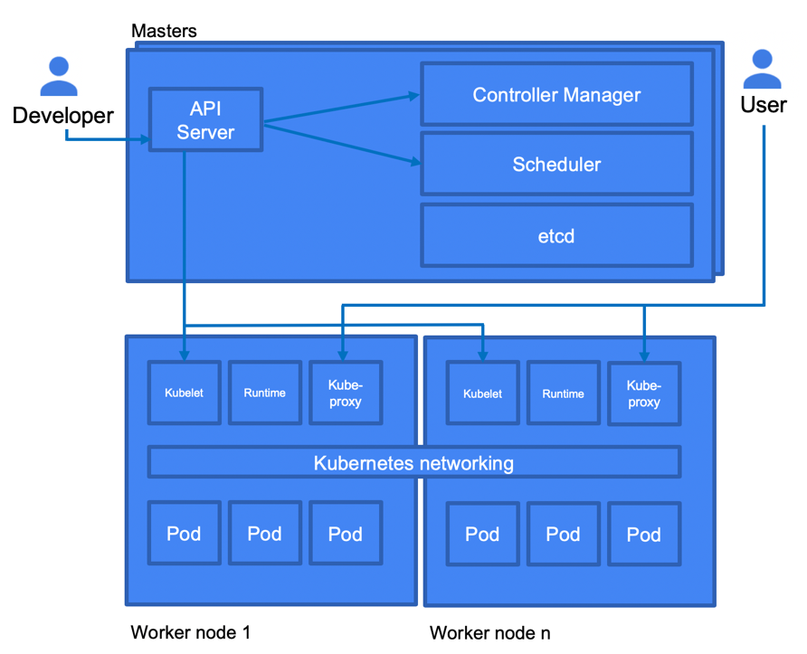
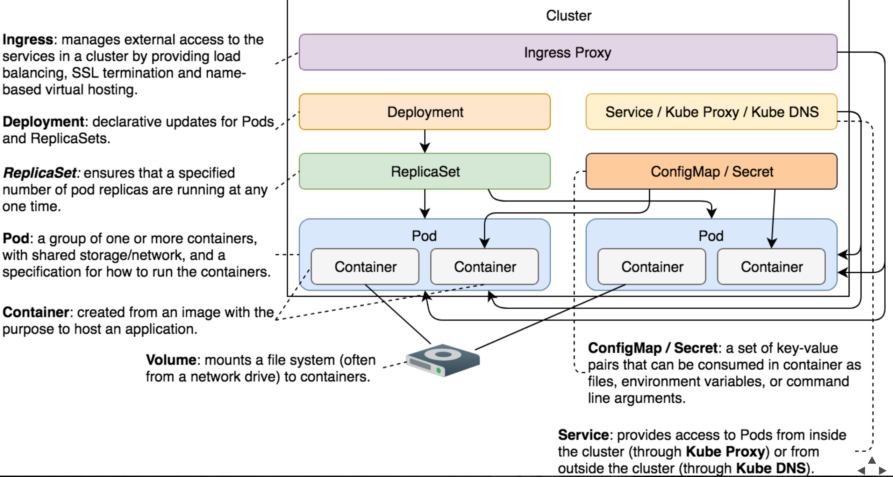

## How Linux Kernel Cgroups And Namespaces Made Modern Containers Possible

- **cgroups**, which stands for control groups, are a kernel mechanism for limiting and measuring the total resources used by a group of processes running on a system. For example, you can apply CPU, memory, network or IO quotas. cgroups were originally developed by Paul Menage and Rohit Seth of Google, and their first features were merged into Linux 2.6.24.

- **Namespaces** are a kernel mechanism for limiting the visibility that a group of processes has of the rest of a system. For example you can limit visibility to certain process trees, network interfaces, user IDs or filesystem mounts. namespaces were originally developed by Eric Biederman, and the final major namespace was merged into Linux 3.8.

#### While virtual machines virtualize hardware, containers virtualize the operating system.

Containers bring the following advantages:

- Isolation: Applications can use their own libraries without conflicting with libraries from other applications.
- Resource limitation: Applications can be limited to the resource's usage.
- Portability: Applications are self-contained with all dependencies and are not tied to an OS or a cloud provider.
- Lightweight: The footprint of the application is much smaller as the containers share a kernel.

## Docker
There are multiple container formats available on the market. Docker is an open platform and allows you to develop and run containerized applications. It can run on multiple Linux images offered in GCP as they have the same kernel. Docker images are created using a definition called a Dockerfile.

 - Immutable   
 - Everything the service needs (but not more)   
 - Inside a Docker registry
-   Docker's Multi-Stage Builds
-   Allows execution of multiple stages while maintaining small size of the final image
-   We run unit tests and we built the application binary
-   The result of the first stage (the binary) was used in the final stage to assemble the image
- Push the built image to a docker registry

##### Microservices on Kubernetes / Docker:
- Docker hosts the API bundle as docker file / images
- Kubernetes manages docker images to create a highly scalable cluster of PODS, it orchestrates the life and times of individual Docker containers, giving us the primitives we need to construct robust and scalable systems.
- It has many features which are especially useful for applications running in production, like service naming and discovery, load balancing, application health checking, horizontal auto-scaling, and rolling updates.
- MiniKube is the software you can install to have Kubernetes on local mac, You can create a minikube cluster of multiple pods within which will be all images of a provided docker image file
- API Gateway can be created by using ambassador or Ingress on Kube	 

## Kubertnetes
Kubernetes, also known as K8s, is an open source container orchestrator that was initially developed by Google and donated to the Cloud Native Computing Foundation. It allows you to deploy, scale, and manage containerized applications. As an open source platform, it can run on multiple platforms both on-premise as well as in the public cloud. It is suitable for both stateless as well as stateful applications.

**Node (Inside a Node Pool) --> Service --> 1+ Pods --> 1+  Containers**
  
A Kubernetes cluster has two types of instances: cluster masters and nodes.

- The cluster master runs four core services that are part of the control plane: controller manager, API server, scheduler, and etcd.
- The controller manager runs services that manage Kubernetes abstract components, such as deployments and replica sets.
- Applications interacting with the Kubernetes cluster make calls to the master using the API server. The API server also handles intercluster interactions.
- The scheduler is responsible for determining where to run pods, which are low-level compute abstractions that support containers.
- ectd is a distributed key-value store used to store state / StatefulSets information across a cluster.
- Nodes are instances that execute workloads. They communicate with the cluster master through an agent called kubelet
- _Node is worker, Each Node can Have a Service, Service can have multiple pods, each pods can have multiple container_

Kubernetes objects are records of intent that are defined in YAML format. They are declarative in nature. Once created, Kubernetes will take care of keeping them in the state declared in the definition file. Some examples of the most important objects are as follows:

- **Pods**: the basic unit in Kubernetes, represents a set of containers that share common resources such as an IP address and storage volumes
- **ReplicaSets**: A ReplicaSet object is used to manage the number of Pods that are running at a given time. A ReplicaSet monitors how many Pods are running and deploys new ones to reach the desired number of replicas. 
- **Deployments**: standard entity that is rolled out with Kubernetes
- **Services**: make deployments accessible from the outside by  providing a single IP/port combination. Services by default  provide access to pods in round-robin fashion using a load balancer. Services are used to group Pods into a single endpoint. As we know, Pods come and go. A service has a stable IP address, and so requests can be sent to it and forwarded to a Pod. Types of Services:
  - ClusterIP: This is a default service that uses an internal ClusterIP to expose Pods. This means that services are not available from outside of the cluster. The use case for ClusterIP is internal communication between microservices within the cluster
  - NodePort: This simply exposes each node outside of the cluster. The Pods can be accessed using <NodeIP>:<NodePort>. If there are multiple nodes, then multiple IP addresses with the same port will be exposed
  - LoadBalancer: This will dynamically create a provider load balancer. In the case of GCP, a network load balancer is created for you. Remember that it uses objects from outside of Kubernetes and generates additional costs
  - ExternalName: This service is exposed using a DNS name specified in the ExternalName spec. The following is a sample definition of a Service of the ExternalName type
  - Ingress: This is an object that allows the routing of HTTP(S) traffic according to the defined rules (paths). It can be associated with one or more Service objects. The services are further associated with Pods. In the case of Google Cloud Platform, the ingress controller creates HTTP(S) load balancers. These load balancers are configured automatically using the definition in the Ingress object

- **Persistent Volumes**: persistent (networked) storage that can be mounted within a container by using a Persistent Volume Claim
- **Namespaces** : Namespaces are essentially virtual clusters within a Kubernetes cluster. In big environments, there can be multiple teams developing an application. By creating namespaces, users are allowed to reuse the names of resources. By default, a Kubernetes cluster comes with three predefined namespaces:
  - default: A default namespace for objects with no other namespace
  - kube-system: Used for resources that are created by Kubernetes
  - kube-public: Reserved for future use:

#### Workloads on Kubernetes

- Stateless applications
   • Does not preserve state, saves no data to persistent disk
   • Deployed using the Deployment object
- Stateful applications
   • State is saved or persisted, uses persistent volumes
   • Deployed using the StatefulSet object
- Batch jobs
   • Finite, independent, parallel jobs
   • Deployed using the Job object
- Daemons
    • Ongoing, background tasks, run without intervention
    • Deployed using a DaemonSet

### MiniKube

- Install minikube + Basic commands:

 `` minikube start --vm-driver virtualbox --cpus 4 --memory 4096
    minikube status
    minikube dashboard
    minikube docker-env
    eval $(minikube docker-env)
    docker container ls``

    minikube ssh
    docker container ls
    exit
    kubectl config current-context
    kubectl get nodes
    minikube stop
    minikube start
    minikube delete`

### Istio

##### ServiceMesh – Kubernetes, Istio, Conduit, Envoy and Consul

###### Features:		
- Load balancing
- Fine-grained traffic policies
- Service discovery
- Service monitoring
- Tracing
- Routing
- Secure service to service communication

###### Implementations:        
- Conduit is a service mesh based on Go and Rust for proxying
- Istio is also a service mesh based on Go, it uses	Envoy Proxy for Data plane, Istio (Pilot, Mixer and Citadel) for Control plane
- Consul can also act as control plane with Envoy proxy as Data plane it can create a very flexible and powerful servicemesh
