## GCP - Google Cloud Platform

**Hierarchy**

- Organization
	- Folders (grouping within org)
	- Project --> Billing account
	    - Resources  --> Labels (k:v)
            
**Internals**

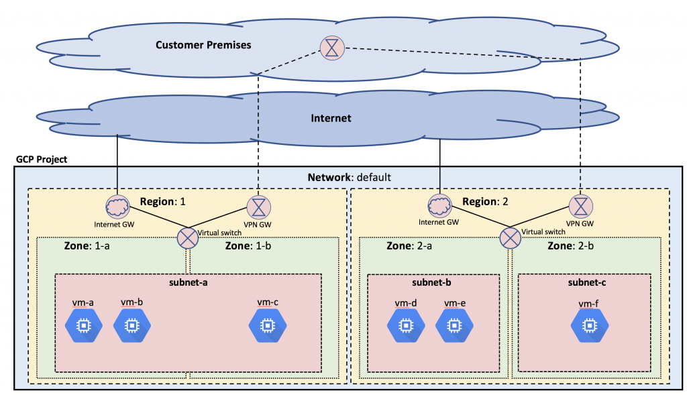

- Network User-controlled IP addresses, subnets and firewalls
- Region -> Set of zones with high-speed network links
- Zone -> Availability zone (similar to a datacenter)

- Global
    - Static external IP addresses
    - Images and snapshots
    - Networks,firewalls,routes
    
- Regional
    - Subnets
    - Regional persistent disks

- Zonal
    - Instances
    - Persistent disks

**Persistent Disks**
   - Block storage
   - Max 64TB in size
   - Pay what you allocate
   - Tied to GCE VMs
   - Zonal or regional access
   - Resize on the  fly
   - Move across zones
   - Create images and snapshots 
   - Encrypted at rest
   
**Buckets**
   - Object storage
   - Infinitely scalable
   - Pay what you use
   - Independent of GCE VMs
   - Global access

**Image**
- Binary file used to instantiate VM rootdisk 
- Usually based off OS image
- Also contains bootloader
- Can also contain customizations
- Managed by GCP image service

**Snapshot**
- Binary file with exact contents of persistent disk 
- “Point-in-time” snapshot
- Managed by GCP snapshot service
- Incremental backups possible too
- Used to back up data from persistent disks

### Networking

GCP offers two service tiers, as follows:

- **Premium**: The premium tier provides high-performance routing. On top of that, it offers global load balancing and a Content Delivery Network (CDN) service. It is aimed at use cases where global presence is required and has the best user experience in mind. This tier comes with Service Level Agreements (SLAs).
- **Standard**: The standard tier is a lower performance network with no SLAs attached. The CDN service is not available and load balancers are regional. It is aimed at use cases where cost is the main deciding factor. The GCP networking that's exposed to the user is based on a Software-Defined Network (SDN) called **Andromeda**. This platform is an orchestration point for all network services in GCP. Fortunately, this is abstracted from the user and there is no need to understand how Andromeda works itself.

### Google Virtual Private Cloud - VPC

 A VPC network is a global, private, isolated virtual network partition that provides managed network functionality on the GCP

- VPC are global
- Subnet in each region (regional subnetwork)
- resources are provisioned on the subnet
- Each VPC must exist inside a project
- Default VPC pre-created in each project 
- can have upto 5 max VPC per project
- VPCs types
    - Auto Mode : Automatically creates one subnet per region with predefined IP ranges with the /20 mask from the 10.128.0.0/9 CIDR block. Each subnet is expandable to the /16 mask.
    - Custom Mode : It does not create subnets automatically and delegates complete control to the user. You decide how many subnets should be created and in which regions.


When you create a new project, a default network is created for you. Subnets are created for each region and have allocated non-overlapping CIDR blocks.

Classless Inter-Domain Routing (**CIDR**) is an IP addressing schema that replaces the classful A, B, C system. It is based on variable-length subnet masks. In the case of CIDR, the prefixes of the subnet can be defined as an arbitrary number, making the network mask length more flexible. This means that organizations can make more efficient utilization of the IP address schemas.

It is possible to convert an auto mode network in a custom mode network, but not the other way round. Remember to not use IP ranges that overlap between VPCs or on-premise if you will be connecting those networks either through VPC peering or VPNs.

#### Subnets

- VPC Contains Subnetworks (Subnet)
- Subnets are Region Specific
- Subnet be in single zone or multiple zone within the region
- Using Subnetworks – we can apply single firewall rules all VMs even if they are in different zone.
- You can create multiple subnets within single region/zone to isolate resources based on different business needs.
- Each Subnet has contiguous private RFC1918 IP Space - IP Range
- Virtual machine (VM) instances in a VPC network can communicate with instances in all other subnets of the same VPC network, regardless of region, using their RFC1918 private IP addresses.
- You can isolate portions of the network, even entire subnets, using firewall rules.
- IP range partitions within global VPCs
- VPCs have no IP ranges
- Subnets are regional - can span zones inside a region
- Network has to have at least one subnet before you can use it
- Each subnet must have primary address range 
- Valid RFC 1918 CIDR block
- Subnet ranges in same network cannot overlap
- Subnet ranges in different networks can overlap
  
#### IP Addresses

VMs can have two types of IP addresses:

- Internal IP address: Assigned within the virtual machine operating system
- External IP address (optional): Assigned to a virtual machine but not visible in the operating system
- IPv4 uses four octets, such as 192.168.20.10. IPv6 uses eight 16-bit blocks, such asFE80:0000:0000:0000:0202:B3FF:FE1E:8329.
- When you create a subnet, you will have to specify a range of IP addresses.
- specify an IP range using the CIDR notation
- **IPv4 IP address followed by a /, followed by an integer. The integer specifies the number of bitsused to identify the subnet (known as subnet mask); the remaining bits are used to determine the hostaddress.**
- You can assign certain resources with IP addresses,You can assign external and internal IP addresses to Compute Engine (VM), forwarding rule for external or internal Load balancing resp.
- Each VM has one primary – internal IP address, one or more secondary IP addresses and one external IP address
- To communicate with VM within VPC you can use internal IP address and to communicate with internet you must use external IP address
- Both internal and external IP addresses can be static or ephemeral

#### Network Cost

The general rule of thumb is that the following traffic is **FREE**:

- Ingress traffic
- Egress within the same zones using internal IPs
- Egress to a different GCP service within the same region using an external IP address or an internal IP address

The following traffic is **charged** for:

- Egress between zones within the regions
- Egress between regions
- Internet egress

### Cross VPC Connectivity

- Shared VPC
- VPC Peering
  
#### Shared VPC

- You may need to put different departments or different applications into different projects for purposes of separating budgeting, access control, and so on
- With Shared VPC, Cloud Organization administrators can give multiple projects permission to use a single, shared VPC network and corresponding networking resources
  
#### VPC Peering

connect two existing VPCs, regardless of whether they belong to the same project or organization

### Routes

- All network have automatically created routes to the internet and IP range in network
- The subnet routes let instances send traffic to any other instance or resource in the same VPC network.
- The default route let instances send traffic outside the VPC n/w
- Name automatically generated
- Applies to traffic egressing a VM
- Forward traffic to most specific route
- Traffic is delivered only if it also matched a firewall rules (ingress)
- Created when subnet is created
- Applies to tagged VM as well
- Enable VM on same subnet to communicate

#### Firewall

 GCP Firewall is a service that allows for micro-segmentation. Firewall rules are created per VPC and can be based on IPs, IP ranges, tags, and service accounts. Several firewall rules are created by default but can be modified.

- Each network has its own firewall controlling access to and from the instances
- You can have “allow” rules , no “deny’ rules
- The default network has automatically created firewall rules that are shown in default firewall rules
- No manually created network has automatically created firewall rules except for a default "allow" rule for outgoing traffic and a default "deny" for incoming traffic.
- Tags :
  - Rules can match tags
  - Tags are user defined Strings
  - Tags are applied to VM and not to IP.

#### Hybrid cloud topology / **Network Links:**

- Virtual Private Network (VPN): VPNs allow a connection between your on-premises network and GCP VPC through an IPsec tunnel over the internet. Only site-to-site VPNs are supported. To establish a VPN connection, there needs to be two gateways on each side of the tunnel. The traffic in transit is encrypted. Both static and dynamic routing are supported, with the former requiring a cloud router. Using a VPN should be the first method of connecting your environment to GCP as it entails the lowest cost. lower-cost option that does not require managing site-to-site connections, but throughput is lower, implemented using IPsec VPNs and supports bandwidths up to 3 Gbps. transmitted over the public Internet

- Cloud Interconnect: If there is a need for low latency and a highly available connection, then interconnect should be considered. In this case, the traffic does not traverse the internet. There are two interconnect options, which are as follows:
  - Dedicated / Direct Interconnect: 10 Gbps each connection piped directly to a Google datacenter - max 8 connections
  - Partner Interconnect: 50 Mbps to 10 Gbps piped through a Google partner
  - Direct peering: works by exchanging Border Gateway Protocol (BGP) routes, which define paths for transmitting data between networks. not recommended...

**Topology:**

- Mirrored topology. In this topology, the public cloud and private on-premise environments mirror each other. This topology could be used to set up test or disaster recovery environments.
- Meshed topology. With this topology, all systems within all clouds and private networks can communicate with each other.
- Gated egress topology. In this topology, on-premises service APIs are made available to applications running in the cloud without exposing them to the public Internet.
- Gated ingress topology. With this topology, cloud service APIs are made available to applications running on premises without exposing them to the public Internet.
- Gated egress and ingress topology. This topology combines gated egress and gated ingress.
- Handover topology. In this topology, applications running on premises upload data to a shared storage service, such as Cloud Storage, and then a service running in GCP consumes and processes that data. This is commonly used with data warehousing and analytic services.

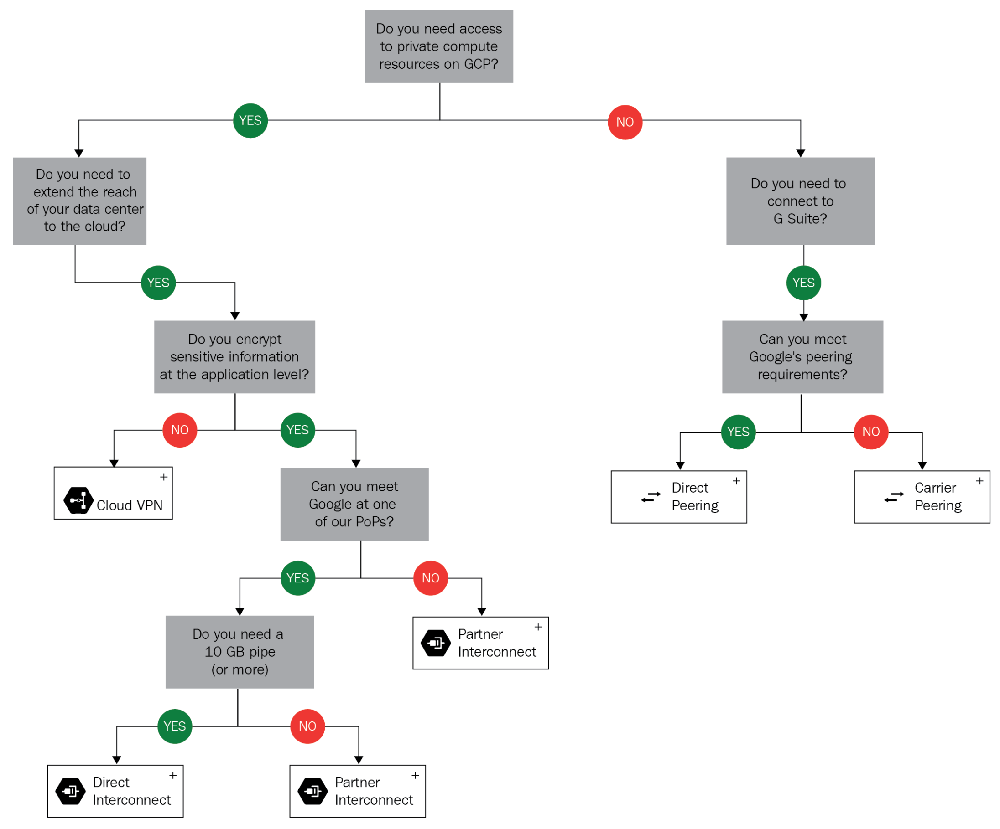

### Load Balancing

High performance, scalable load balancing, GCP provides Global Load Balancing - Scale your applications on Google Compute Engine from zero to full-throttle. Distribute your load balanced compute resources in single or multiple regions, close to your users and to meet your high availability requirements.

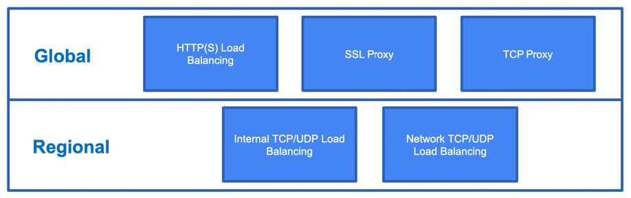

Types:

- **Network TCP/UDP regional**
  - uses forwarding rules to determine how to distribute traffic.
  - Forwarding rules use the IP address, protocol, and ports to determine which servers, known as a target pool, should receive the traffic.

- **Internal TCP/UDP regional**: only internal load balancer
  
- **HTTP(S)** : global premium network tier
  - distribute HTTP and HTTPS traffic globally
  - use forwarding rules to direct traffic to a target HTTP proxy. then route the traffic to a URL map, which determines which target group to send the request to based on the URL

- **SSL Proxy** : global premium network tier
 SSL offloading terminates SSL/TLS traffic at the load balancer and distributes traffic across the set of backend servers

- **TCP Proxy** : global premium network tier
lets you use a single IP address for all users regardless of where they are on the globe, and it will route traffic to the closest instance. should be used for non-HTTPS and non-SSL traffic.

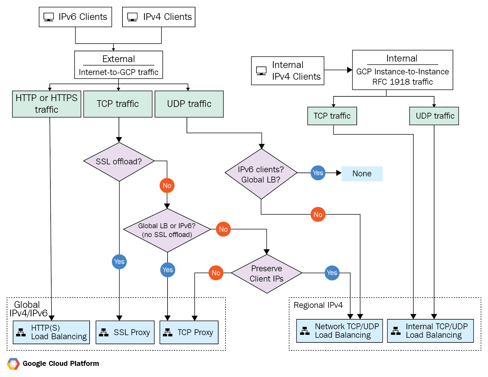

### Cloud Router

Cloud Router is a service that allows for dynamic routing exchange between Compute Engine, VPNs, and external networks. It eliminates the need for the creation of static routes.

### Cloud NAT

Cloud [NAT](https://en.wikipedia.org/wiki/Network_address_translation) is a regional service that allows VMs without external IPs to communicate with the internet. It is a fully managed service with built-in autoscalability. It works with both GCE and GKE. It is a better alternative for NAT instances that need to be managed by users. There are currently two options for NAT, as follows:

- NAT gateway
- Cloud NAT (Google Recommended)

### Google Cloud CDN

- leverages Google's globally distributed edge caches to accelerate content delivery for websites and applications served out of Google Compute Engine.
- Cloud CDN lowers network latency, offloads origins, and reduces serving costs. Once you've set up HTTP(S) Load Balancing, simply enable Cloud CDN with a single checkbox

### Google Cloud DNS

- scalable, reliable and managed authoritative Domain Naming System (DNS) service running on the same infrastructure as Google.
- It has low latency, high availability and is a cost-effective way to make application and services available to your users.

#### Google COMPUTE ENGINE - Raw Vms

Managed instance groups are the best way to create a cluster of VMs, all running the same services in the same configuration. A managed instance group uses an instance template to specify the configuration of each VM in the group.

##### login to compute vm instance

gcloud beta compute ssh --zone "us-central1-a" "unicorn-instance-1" --project "perfect-transit-278123"

##### stop instance

gcloud compute instances stop unicorn-instance-1

##### start instance

gcloud compute instances start unicorn-instance-1

##### create GCP  compute template from existing vm instance

gcloud compute instance-templates create basic-vm-instance-template \
    --source-instance=unicorn-instance-1 \
    --source-instance-zone=us-central1-a

##### existing instance details

gcloud compute instances list

### Google App Engine GAE

- Platform as a Service PaaS - Deploy your Apps from your code / github etc to STD Image.
- each project can host only one App Engine application. application can have multiple services with multiple versions
- Which version is served to the end user is based on the network traffic configuration
- Applications in App Engine are deployed regionally
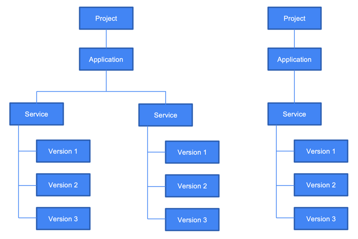

**Standard**

- App runs on **containers** running in GCP
- Instances start up in seconds
- can scale down to 0
- Code in few languages/versions only
- No other runtimes possible
- Apps cannot access Compute Engine resources
- No installation of third-party binaries

**Flexible**

- Flexible environment uses **GCE virtual machine** instances
- Instance start up in minutes 
- can scale down to 1
- Code in far more languages/ versions 
- Custom runtimes possible
- Apps can access Compute Engine resources, some OS packages
- Can install and access third-party binaries 
##### create blank app instance

gcloud app create

get the code in local and make sure it has app.yaml
git clone \
    <https://github.com/GoogleCloudPlatform/golang-samples>

    cd \
    golang-samples/appengine/go11x/helloworld

##### deploy the code for go app into the GAE

gcloud app deploy

##### You can stream logs from the command line by running

  $ gcloud app logs tail -s default

#### GAE Memcache

Memcache is a service that's built in to App Engine. It allows you to keep key-value pairs in memory that can be accessed much faster than querying a database. There are two service levels for Memcache, as follows:

- **Shared**: This is the default and free version of Memcache. Note that this service is provided on best effort. The resources are shared with multiple applications within the App Engine platform.
- **Dedicated**: This is an optional and paid version of Memcache. It provides a fixed cache capacity dedicated to your application. It is paid per GB/hour. This should be used for applications that require predictable performance.

### [Kubernetes](Docker-Kube-Istio.md) - Managed Containers orchestration with docker

### Google Kubernetes Engine GKE

GKE is a fully managed service that allows us to provision Kubernetes clusters on demand. It offloads the burden of deploying clusters manually. It also comes with a number of benefits that manual deployment does not offer, such as the following:

- Automated cluster provisioning
- Automated cluster scaling
- Automated upgrades
- Auto-repair
- Integrated load balancing
- Node pools
- Integration with Stackdriver for monitoring and logging
- A GKE cluster can be deployed in two modes: zonal or regional. In a zonal deployment, only one master node is deployed. In a regional deployment, three masters are deployed in different zones. This is shown in the following diagram:
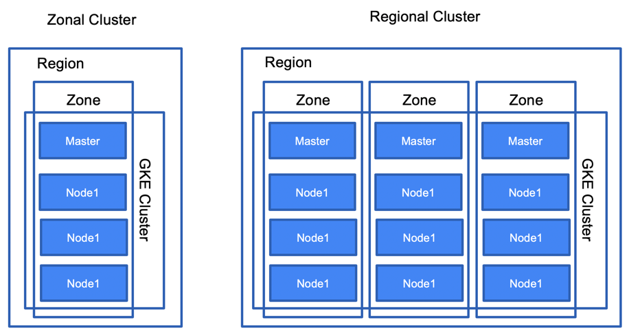

**Node pools**
Node pools are used to put worker nodes into groups with the same configuration. When you create your first cluster, all the nodes are put into the default node pool. You might want to have multiple node pools if you want to have groups with specific characteristics, such as local SSDs, minimum CPU, a specific node image, or using a preemptible instance:

**Set Auth for GCP on local**

**gcloud** is used for managing the GKE cluster while **kubectl** is a Kubernetes native tool. So, as an example, if you want to scale a GKE cluster, you would use gcloud, while for scaling a deployment, you would use kubectl.

```yaml

    gcloud container clusters get-credentials dean-kube-cluster-1 --zone us-central1-c

    gcloud container clusters  list

    gcloud container clusters describe dean-kube-cluster-1 --zone us-central1-c

    kubectl config current-context

    kubectl create -f examples/guestbook-go/redis-master-controller.json

    kubectl get rc
    kubectl get pods

    kubectl create -f examples/guestbook-go/redis-master-service.json
    kubectl get services
    kubectl create -f examples/guestbook-go/redis-slave-controller.json
    kubectl get services
    kubectl get rc

    kubectl get services
    kubectl get pods
    kubectl create -f examples/guestbook-go/redis-slave-service.json
    kubectl get services
    kubectl create -f examples/guestbook-go/ guestbook-controller.json
    kubectl get rc
    kubectl get pods
    kubectl create -f examples/guestbook-go/ guestbook-service.json
    kubectl get services
    kubectl get services --watch
``` 

Kubernetes Engine uses Compute Engine services. ***You are billed for every virtual machine instance that is running as a node of the cluster***. Because Kubernetes Engine abstracts master machines, you are not charged for them.

### Cloud Functions (FaaS Serverless Compute)

Serverless, Event-Driven, Stateless and Autoscaling (0 to desired scale). Cloud Functions use three components: events, triggers, and functions. An event is an action that occurs in the GCP. Cloud Functions does not work with all possible events in the cloud platform; instead, it is designed to respond to five kinds of events.
   - Cloud Storage
   - Cloud Pub/Sub
   - HTTP
   - Firebase/FireStore
   - Stackdriver Logging

A trigger in Cloud Functions is a specification of how to respond to an event. Triggers have associated functions. Currently, Cloud Functions can be written in Python 3, Go, and Node.js 8 and 10.

**Pricing depends on number of Invocations, Compute time, and network rate (Networking)**

### Cloud Run

- alternative to Cloud Functions if you want to use a language that is not supported by Cloud Function
- Develop and deploy highly scalable containerized applications on a fully managed serverless platform with autoscaling.
- Write code your way using your favorite languages, lib or binary (Go, Python, Java, Ruby, Node.js, and more)
- Abstract away all infrastructure management for a simple developer experience
- Built upon an open standard Knative, enabling the portability of your applications
- Pay per use to 100 millisec

#### _The gsutil command is used only for Cloud Storage_

#### gcloud command, you can interact with other Google Cloud products like the App Engine, Google Kubernetes Engine etc

### Google Stackdriver

Suite of ops services providing monitoring, logging, debugging, error reporting, tracing, alerting and profiling. Integrates with several third-party tools

- used for monitoring, logging and APM
- agentless, more detailed will need agent collectd for monitoring and fluentd for logging

### Storage Usecases

| Use Case                                          | Appropriate GCP Service          | Non-GCP Equivalents                  |
| ------------------------------------------------- | -------------------------------- | ------------------------------------ |
| Block storage                                     | Persistent disks   or local SSDs | AWS   EBS, Azure Disk                |
| Object/blob   storage                             | Cloud Storage   (GCS) buckets    | AWS   S3, Azure Blob Storage         |
| Relational data -   small, regional payloads      | Cloud SQL                        | AWS   RDS, Azure SQL Database        |
| Relational data -   large, global payloads        | Cloud Spanner                    |                                      |
| HTML/XML documents   with NoSQL access            | Firestore                        | AWS   DynamoDB, Azure Cosmos DB      |
| Large, naturally   ordered data with NoSQL access | BigTable                         | HBase                                |
| Analytics and   complex queries with SQL access   | BigQuery                         | AWS   Redshift, Azure Data Warehouse |

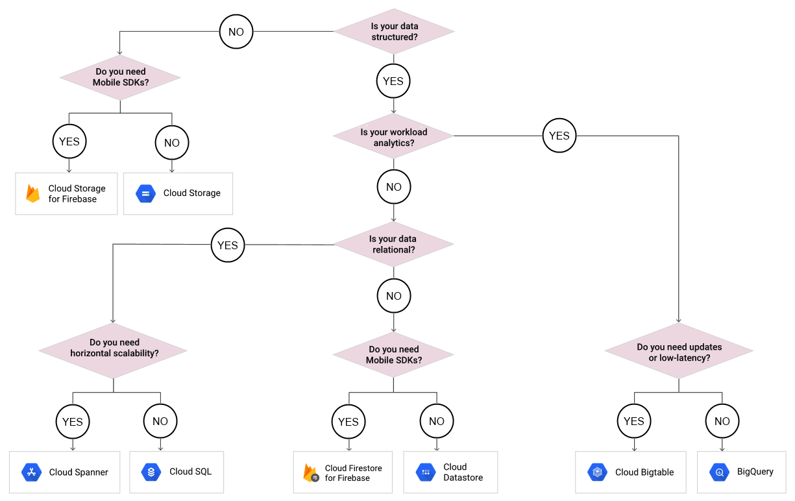

### GCP Databases

Several factors influence the choice of storage system / databases, such as the following:

- Is the data structured or unstructured?
- How frequently will the data be accessed?
- What is the read/write pattern? What is the frequency of reads versus writes?
- What are the consistency requirements?
- Can Google managed keys be used for encryption, or do you need to deploy customer managed keys?
- What are the most common query patterns?
- Does your application require mobile support, such as synchronization?
- For structured data, is the workload analytic or transactional?
- Does your application require low-latency writes?
- The answer to these and similar questions will help you decide which storage services to use and how to configure them.

#### Cloud Filestore (NAS)

- network-attached storage service that provides a filesystem that is accessible from Compute Engine and Kubernetes Engine. Cloud Filestore is designed to provide low latency and IOPS, so it can be used for databases and other performance-sensitive services.
- Some typical use cases for Cloud Filestore are home directories and shared directories, web server content, and migrated applications that require a filesystem.

#### Cloud SQL

- RDBMS - MySQL/ PostGres / SQLServer - 10 tb max data, 208 gb ram, 32 cores,
- Transactional support, ACID support

#### Cloud Datastore/Firestore

- Store JSON docs, Document DB like MongoDB, Flexible, scalable
- NoSQL database for keeping data in sync across client apps, Mobile and web server development, Realtime listeners
    - Regional or multi-regional resource scope
    - Cloud-native NoSQL
    - Strong mobile support
    - Offline support for clients
    - Documents and collections
    - ACID compliance

#### Cloud Storage - File Storage / Object store

 - cloud storage life cycle - > store to standard --> after 6 months move to nearline storage 1 year --> coldline storage 5 yr - delete it
 - like S3
 - store immutable files, read it and delete it, cant edit
 - 11 9s durability
 - cloud storage is HDFS compliant same way we can read files like hadoop - hdfs:// vs gs://
 - cloud object notification --> pubsub or functions 

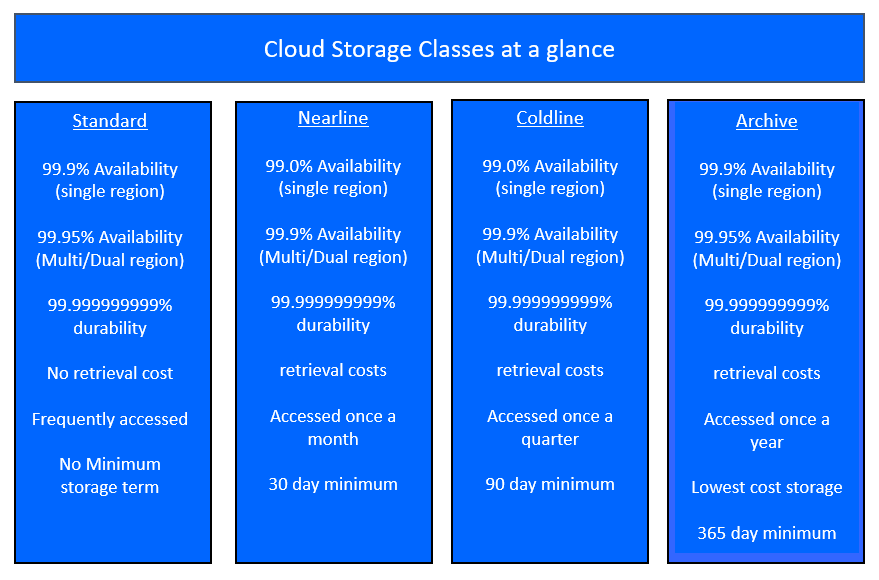

#### Cloud Memorystore

Reduce latency with scalable, secure, and highly available in-memory service for Redis and Memcached.

### GCP Bigdata

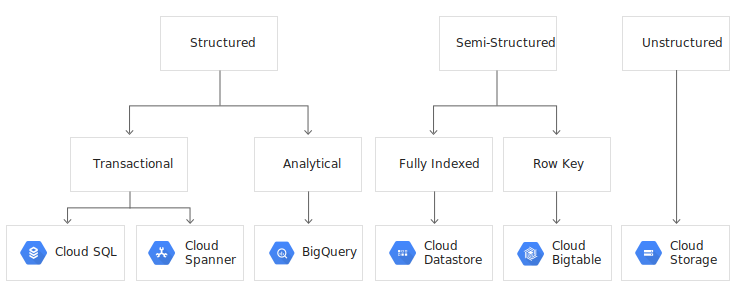

#### Spanner

- Google RDBMS / SQL horizontally scalable - the best RDBMS on the Planet
- Strongly consistent
- can host petabytes of data
- global db with multi regions
- ACID support with atomic transactions
- auto replication (R/W, read-only, witness)
- 99.999% availability
- charged for data nodes hourly + data storage + egress
- **Relational databases can scale horizontally, but that requires server clock synchronization if strong consistency is required among all nodes. Cloud Spanner uses the TrueTime service, which depends on atomic clocks and GPS signals to track time.**
  
#### Bigtable - HBase kind...sequential ordering in key column; provides very fast writes as well as reads

   - Regional resource scope
   - Managed NoSQL
   - Scalable but not serverless
   - Powers well-known apps like gmail, maps etc
   - HBase compatible
   - Great for many concurrent reads/writes
   - Can host petabytes
   - Great for OLAP/Analytics and realtime access, IOT with high speed txns, time series usecase 
   - Only provide single row level ACID txn

#### BigQuery

- EDW Enterprise data warehouse, fully managed, petabyte scale, low cost enterprise data warehouse for analytics, Serverless, There is no infrastructure to manage and you don't need a database administrator, so you can focus on analyzing data to find meaningful insights using familiar SQL.
    - Regional resource scope
    - OLAP
    - Scales to Petabytes
    - SQL (ANSI:2011) compliant
    - Dedicated CLI
    - Separate compute and storage tiers
    - Integrates with ML and BI offerings

#### Dataflow

- Apache Beam impl for ETL and Streaming both 
- unified programming for both batch and streaming. dynamic workflow rebalancing
- fully managed and auto scales. 
- Developers can write stream and batch processing code using Java, Python, and SQL. If you need to process the data, for example applying transformations to a stream of IoT data, then Cloud Dataflow is good option.
- completely serverless and fully managed

#### DataProc

- Hadoop / Spark Cluster for batch / hadoop only, Use Google Cloud Dataproc, a managed Spark and Hadoop service, to easily process big datasets using the powerful and open tools in the Apache big data ecosystem.
- provides spark, hive, pig, hdfs, python
- leverages GCE underneath
- can leverage ephemeral nodes for lower cost
- pay only for use and desroy cluster after job

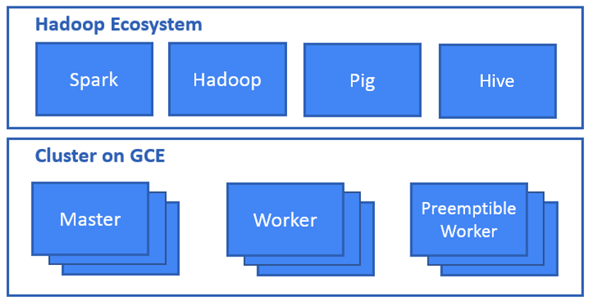

#### Cloud IOT

- fully managed service that allows us to securely connect, manage, and ingest data from devices spread around the globe
- serverless
- communicate over HTTP or MQTT
- MQTT is a Publish/Subscribe protocol and is often used with embedded devices. **MQTT is considered data-focused and better suited to IoT**.
- device manager: used for registering, configuring, updating, RBAC and communication with IOT devices
- pricing is based on data volume used per month

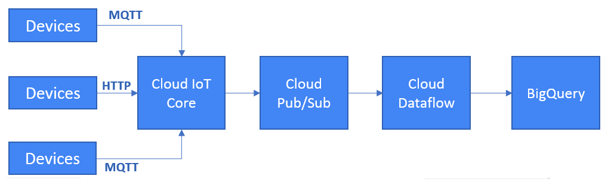

#### Cloud Datalab

- Analytical / Visual tool, interactive notebook (based on **Jupyter**) to explore, collaborate, analyze and visualize data. It is integrated with BigQuery and Google Cloud Machine Learning to give you easy access to key data processing services

#### Cloud Pub/Sub

- Event Driven and is a message queue (e.g. Rabbit MQ), serverless, large scale, reliable, real-time messaging service that allows you to send and receive messages between independent applications, 
- You can leverage Cloud Pub/Sub’s flexibility to decouple systems and components hosted on Cloud Platform or elsewhere on the Internet. 
- By building on the same technology Google uses, Cloud Pub/Sub is designed to provide “at least once” delivery at low latency with on-demand scaling to tens of millions of messages per second.
- It supports both push and pull subscriptions.
- *With a push subscription, message data is sent to by HTTP POST request to a push endpoint URL. The push model is useful when a single endpoint processes messages from multiple topics.*
- It’s also a good option when the data will be processed by an App Engine Standard application or a Cloud Function. Both of those services bill only when in use, and *pushing a message avoids the need to check the queue continually for messages to pull.*
- With a pull subscription, a service reads messages from the topic. This is a good approach when processing large volumes of data and efficiency is a top concern.
- Pub/Sub is billed per message ingestion and delivery. There is also a storage charge for retained acknowledged messages.
  
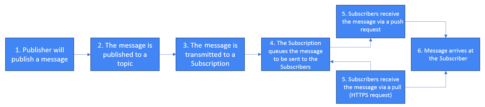

#### Dataprep

This is a tool that can be used to perform data visualization and exploring without any coding skills being required. Data can be interactively prepared for further analysis.

#### Data Studio

This a BI (Business Intelligence) tool that allows you to consume data from sources and visualize it in the form of reports and dashboards.

#### Cloud Composer

This is a fully managed service based on open source Apache Airflow. It allows you to create and orchestrate big data pipelines. 

#### Stackdriver

- Logging receives, indexes, and stores log entries from many sources, including Google Cloud Platform, Amazon Web Services, VM instances running the Stackdriver Logging fluentd agent, and user applications.
- All log entries in Stackdriver Logging are represented using a single data type, LogEntry, which defines certain common data for all log entries as well as carrying individual payloads.

- Stackdriver Trace is a distributed tracing system for Google Cloud Platform that collects latency data from Google App Engine, Google HTTP(S) load balancers, and applications instrumented with the Stackdriver Trace SDKs, and displays it in near real time in the Google Cloud Platform Console.
- It helps you understand how long it takes your application to handle incoming requests from users or other applications, and how long it takes to complete operations like RPC calls performed when handling the requests.
- Currently, Stackdriver Trace collects end-to-end latency data for requests to App Engine URIs and additional data for round-trip RPC calls to App Engine services like Datastore, URL Fetch, and Memcache.

#### GCP ML/AI (Maching Learning)

- **TensorFlow** (for data scientist): This is an option for those who want to work with ML from scratch. It is a software library that's developed and open-sourced by Google. There are more libraries on the market, but this one is the most popular and is used by other cloud providers for their managed ML services.
- **ML Engine** (for data scientist): This is an option for those who want to train their own models, but who use Google for training and predictions. It is a managed TensorFlow service that offloads all infrastructure and software bits from users.
  - ML engine can be accessed via cloud console or gcloud ml-engine command
  - to make predictions use REST API or Python API client
  - multiple scale tiers with predefined master, workder and parameter servers 
- **Pretrained ML models** (for developer): This is an option for those who want to leverage ML without having any knowledge of it. It allows Google-developed models to be used to perform predictions. (Speech-to-Text, Text-To-Speech, Translation, Natural Language, Vision, Video Intelligence API, Video Intelligence API etc)
- **AutoML** (for developer): This is an option for those who want to leverage ML without having any knowledge of it, and where the pretrained models are not fit for purpose. It allows models to be trained by supporting labeled data.

#### TPU - Tensor Processing Unit

- Google's custom-developed, application-specific integrated circuits (ASICs), which are used to speed up ML workloads
- enhance the performance of linear algebra computation
- reduction in model training time from weeks to hours
- TPU suitable for matrix computations, Models without custom TensorFlow operations inside the main training loop, Models that take a long time to train (in weeks) or with very large batch size

### Google Cloud Security

#### GCP Identity

- Cloud Identity is a key GCP service that's offered by Google as an Identity as a Service (IDaaS) solution
- Free and Premium Tier
- Google Cloud Directory Sync (GCDS) can synchronize an organization's AD or LDAP database onto Cloud Identity and it is highly scalable. Synchronization is only one-way, that is, from on premises to GCP, and so your on-site DB is never compromised

- Google accounts
- Service accounts
- Google groups
- GSuite domains
- Cloud Identity domains

#### Cloud IAM

- Roles :  diff roles defined
- Member : who can get access
- Policy : join both roles to member

#### encryption at rest

- Data at rest is encrypted by default in Google Cloud Platform.
- Data is encrypted at multiple levels, including the application, infrastructure, and device levels.
- Data is encrypted in chunks. Each chunk has its own encryption key, which is called a data encryption key.
- Data encryption keys are themselves encrypted using a key encryption key.

#### Key management

1. default key management - inbuilt in gcp
2. kms - store keys into gcp kms 
3. Customer supplied keys - keys are stored on prem and then sent over to services along with request and it not persisted on gcp  

#### Identity Aware Proxy (IAP)

IAP is a service that replaces the VPN when a user is working from an untrusted network. It controls access to your application based on user identity, device status, and IP address. It is part of Google's BeyondCorp security model.

#### Cloud Armor

Cloud Armor is a service that allows protection against infrastructure DDoS attacks using Google's global infrastructure and security systems. It integrates with global HTTP(S) load balancers and blocks traffic based on IP addresses or ranges. Preview mode allows users to analyze the attack pattern without cutting off regular users.

#### GCP Management Options

- APIs
  
  APIs available over REST to create GCp resources, can use API key, OAuth or service accounts to autz and create resources
- Cloud Deployment Manager
  
    Service that allows you to specify infrastructure as code (IaC) in YAML. It is a good practice to define infrastructure as code, since it allows teams to reproduce environments rapidly. It also lends itself to code reviews, version control, and other software engineering practices.
    - It leverages **gcloud** deployment-manager   command
    - Full / multi env deployment can be done using templates (templates are written in Python/Jinja)

- Cloud Shell
  
  Directly login using cloud console and open shell embedded into browser, provides 5GB local storage with a tiny GCE instance to run commandline scripts, you can upload download scripts open them in vim and run them

- GCP SDK
  
  set of tools which can be installed on local to interact with GCP via commandline
  
  1. gcloud: A command-line tool for interacting with most GCP services (GCE, SQL, GKE, DataProc, DNS,Deployment Manager, Code/git, Docket Repo)
  2. gsutil: A command-line python tool for working with Cloud Storage
  3. bq: A command-line tool for working with BigQuery
  4. cbt: Commandline tool written in Golang for BigTable
  
#### Security Evaluation

##### Penetration testing

- **Reconnaissance** is the phase at which penetration testers gather information about the target system and the people who operate it or have access to it. This could include phishing attacks that lure a user into disclosing their login credentials or details of software running on their network equipment and servers.
- **Scanning** is the automated process of probing ports and checking for known and unpatched vulnerabilities.
- **Gaining access** is the phase at which the attackers exploit the information gathered in the first two phases to access the target system.
- In the **maintaining access phase**, attackers will do things to hide their presence, such as manipulating logs or preventing attacking processes from appearing in a list of processes running on a server.
- **Removing footprints**, the final phase, involves eliminating indications that the attackers have been in the system. This can entail manipulating audit logs and deleting data and code used in the attack.

##### Auditing

- All managed services does automatic audit logging
- Cloud Audit Logs - service provided by gcp that records administrative actions and data operations. Administrative actions that modify configurations or metadata of resources is always logged by Cloud Audit Logs.

#### SECURITY DESIGN PRINCIPLES

- **Separation of duties (SoD)** is the practice of limiting the responsibilities of a single individual in order to prevent the person from successfully acting alone in a way detrimental to the organization. 
- **Least privilege** is the practice of granting only the minimal set of permissions needed to perform a duty. IAM roles and permissions are fine-grained and enable the practice of least privilege.
- **Defense in depth** is the practice of using more than one security control to protect resources and data
  
#### Designing a solution infrastructure that meets business requirements

- Business use cases and product strategy
- Cost optimization
- Supporting the application design
- Integration
- Movement of data
- Tradeoffs
- Build, buy or modify
- Success measurements (e.g., Key Performance Indicators (KPI), Return on Investment (ROI), metrics)
- Compliance and observability

#### IMPROVING COMPLIANCE WITH INDUSTRY REGULATIONS

- Health Insurance Portability and Accountability Act (HIPAA), a healthcare regulation
- Children’s Online Privacy Protection Act (COPPA), a privacy regulation
- Sarbanes-Oxley Act (SOX), a financial reporting regulation
- Payment Card Industry Data Standard (PCI), a data protection regulation for credit card processing
- General Data Protection Regulation (GDPR), a European Union privacy protection regulation

- Service-Level Agreement (SLA) An agreement between a provider of a service and a customer using the service. SLAs define responsibilities for delivering a service and consequences when responsibilities are not met.

- Service-Level Indicator (SLI) A metric that reflects how well a service-level objective is being met. Examples include latency, throughput, and error rate.

- Service-Level Objective (SLO) An agreed-upon target for a measurable attribute of a service that is specified in a service-level agreement.

#### Cloud TCO

The combination of all expenses related to maintaining a service, which can include the following:
- Software licensing costs
- Cloud computing costs, including infrastructure and managed services
- Cloud storage costs
- Data ingress and egress charges
- Cost of DevOps personnel to develop and maintain the service
- Cost of third-party services used in an application
- Charges against missed service-level agreements
- Network connectivity charges, such as those for a dedicated connection between an on-premises data center and Google Cloud

#### MIGRATION SERVICES AND TOOLS

Migrations typically require the transfer of large volumes of data and depends on:

- Volume of data
- Network bandwidth
- Workflow time constraints on data transfer
- Location of data

- Google Transfer Service - allows for the transfer of data from an HTTP/S location, an AWS S3 bucket, or a Cloud Storage bucket
- gsutil command-line utility
- Google Transfer Appliance
- Third-party vendors

#### Migration Planning

- Integrating cloud services with existing systems
- Migrating systems and data
- License mapping
- Network management planning
- Testing and proof-of-concept development

##### five-step migration planning

- Assessment
- Pilot
- Data migration
- Application migration
- Optimization

### Google Architect Certification Case Studies

#### Dress4Win https://cloud.google.com/certification/guides/cloud-architect/casestudy-dress4win-rev2

Existing:
- wardrobe using a web app and mobile application
- active social network that connects their users with designers and retailers
- several hundred servers and appliances in a collocated data center
- infrastructure is now insufficient for the application’s rapid growth. 
- innovate faster, Dress4Win is committing to a full migration to a public cloud.
- moving their development and test environments
- building a disaster recovery site 
- servers run Ubuntu LTS v16.04
- MySQL: 1 server for user data, inventory, and static data
- Redis: 3 server cluster for metadata, social graph, and caching
- 40 Web application servers providing micro-services based APIs and static content.
- 20 Apache Hadoop/Spark servers for Data analysis and Real-time trending calculations
- 3 RabbitMQ servers for messaging, social notifications, and events

Business Requirements
- Build a reliable and reproducible environment with scaled parity of production.
- Improve security by defining and adhering to a set of security and Identity and Access Management (IAM) best practices for the cloud.
- Improve business agility and speed of innovation through rapid provisioning of new resources.
- Analyze and optimize architecture for performance in the cloud.

Technical Requirements
- Easily create non-production environments in the cloud.
- Implement an automation framework for provisioning resources in cloud. Implement a continuous deployment process for deploying applications to the on-premises data center or cloud.
- Support failover of the production environment to the cloud during an emergency.
- Encrypt data on the wire and at rest.
- Support multiple private connections between the production data center and cloud environment.

Observations:
- Our traffic patterns are highest in the mornings and weekend evenings; during other times, 80 percent of our capacity is sitting idle.
- Our capital expenditure is now exceeding our quarterly projections
- total cost of ownership (TCO) analysis over the next five years for a public cloud strategy achieves a cost reduction of 30–50 percent over our current model

#### Mountkirk Games https://cloud.google.com/certification/guides/cloud-architect/casestudy-mountkirkgames-rev2

Existing:
- online, session-based, multiplayer games for mobile platforms
- popularity of some of their games, they have had problems scaling their global audience, application servers, MySQL databases, and analytics tools
- write game statistics to files and send them through an ETL tool that loads them into a centralized MySQL database for reporting
- plan to deploy the game’s backend on the Google Compute Engine so that they can capture streaming metrics, run intensive analytics, and take advantage of its autoscaling server environment and integrate with a managed NoSQL database.

Business Requirements
- Increase to a global footprint
- Improve uptime (downtime is loss of players)
- Increase efficiency of the cloud resources they use
- Reduce latency to all customers

Technical Requirements
- Requirements for Game Backend Platform
    - Dynamically scale up or down based on game activity.
    - Connect to a transactional database service to manage user profiles and game state.
    - Store game activity in a time series database service for future analysis.
    - As the system scales, ensure that data is not lost due to processing backlogs.
    - Run hardened Linux distro.

- Requirements for Game Analytics Platform
    - Dynamically scale up or down based on game activity.
    -  Process incoming data on the fly directly from the game servers.
    -  Process data that arrives late because of slow mobile networks.
    -  Allow queries to access at least 10 TB of historical data.
    -  Process files that are regularly uploaded by users’ mobile devices.
    
Observations:    
 - Our investors want more key performance indicators (KPIs) to evaluate the speed and stability of the game, as well as other metrics that provide deeper insight into usage patterns
 - our current technology stack cannot provide the scale we need, so we want to replace MySQL and move to an environment that provides autoscaling, low-latency load balancing, and frees us up from managing physical servers.


#### TerramEarth https://cloud.google.com/certification/guides/cloud-architect/casestudy-terramearth-rev2
Existing:
- manufactures heavy equipment for the mining and agricultural industries
- currently have over 500 dealers and service centers in 100 countries
- 20 million TerramEarth vehicles in operation that collect 120 fields of data per second
- 200,000 vehicles are connected to a cellular network, allowing TerramEarth to collect data directly
- collects a total of about 9 TB of data per day from these connected vehicles 200,000
- systems gzip CSV files from the field, upload via FTP, and place the data in their data warehouse. 
- reports are based on data that is three weeks old due to delay
- because the data is stale, some customers are without their vehicles for up to four weeks

Business Requirements
- Decrease unplanned vehicle downtime to less than one week
- Support the dealer network with more data on how their customers use their equipment to position new products and services better.
- Have the ability to partner with different companies—especially with seed and fertilizer suppliers in the fast-growing agricultural business—to create compelling joint offerings for their customers.

Technical Requirements
- Expand beyond a single data center to decrease latency to the American Midwest and east coast
- Create a backup strategy
- Increase security of data transfer from equipment to the data center
- Improve data in the data warehouse
- Use customer and equipment data to anticipate customer needs
