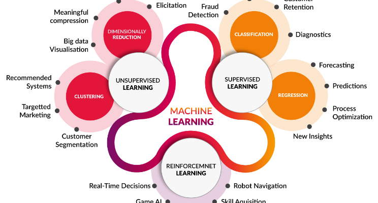

## Machine Learning Basics

Machine Learning algorithms can be classified into:

1. Supervised Algorithms – Linear Regression, Logistic Regression, Support Vector Machine (SVM), Decision Trees, Random Forest
2. Unsupervised Algorithms – K Means Clustering.
3. Reinforcement Algorithm

### Supervised Machine Learning - 
The data set on which the machine is trained consists of labelled data or simply said, consists both the input parameters as well as the required output. training dataset will already be classified into the given labels based on certain parameters through which the machine will learn these features and patterns and classify some new input data based on the learning from this training data.

* Supervised Learning Algorithms can be broadly divided into two types of algorithms:
    * Regression
    * Classification

* Regression Algorithms - These algorithms are used to determine the mathematical relationship between two or more variables and the level of dependency between variables. These can be used for predicting an output based on the interdependency of two or more variables.    
* Types : Linear Regression and Logistic Regression

##### Linear Regression - 
Linear regression is used with continuously valued variables, like the previous example in which the price of the product and amount of consumption are continuous variables, which means that they can have an infinite number of possible values. Linear regression can also be represented as a graph known as scatter plot, where all the data points of the dependent and independent variables are plotted and a straight line is drawn through them such that the maximum number of points will lie on the line or at a smaller distance from the line. This line – also called the regression line, will then help us determine the relationship between the dependent and independent variables along with which the linear regression equation is formed.
* Simple Linear Regression - we predict scores on one variable from the ratings on a second variable
* Multiple Linear Regression - the multiple linear regression is used to explain the relationship between one dependent variable with two or more than two independent variables.
* Polynomial regression - the maximum power of the independent variable is more than 1, the best fit line is not a straight line instead it is in the form of a curve

##### Classification - 
* Logistic Regression / Classification - The difference between linear and logistic regression is that logistic regression is used with categorical dependent variables (eg: Yes/No, Male/Female, Sunny/Rainy/Cloudy, Red/Blue etc.), unlike the continuous valued variables used in linear regression. Logistic regression helps determine the probability of a certain variable to be in a certain group like whether it is night or day, or whether the colour is red or blue etc. The graph of logistic regression consists of a non-linear sigmoid function which demonstrates the probabilities of the variables.
* KNN Classification Algorithm - This algorithm is used to classify a set of data points into specific groups or classes based on the similarities between the data points. A majority vote of an object is classified by its neighbours, with the purpose being assigned to the class most common among its k nearest neighbours. It can also use for regression — output is the value of the object (predicts continuous values). This value is the average (or median) of the benefits of its k nearest neighbours.
* Support Vector Machine - a discriminative classifier formally defined by a separating hyperplane. The algorithm outputs an optimal hyperplane which categorises new examples. In two dimensional space, this hyperplane is a line dividing a plane into two parts wherein each class lay on either side.
* Naive Bayes - based on Bayes’ Theorem with an assumption of independence among predictors. In simple terms, a Naive Bayes classifier assumes that the presence of a particular feature in a class is unrelated to the presence of any other function. 
* Decision tree - makes classification models in the form of a tree structure. An associated decision tree incrementally developed and at the same time It breaks down a large data-set into smaller subsets. The final result is a tree with decision nodes and leaf nodes. A decision node (e.g., Root) has two or more branches. Leaf node represents a classification or decision. The first decision node in a tree which corresponds to the best predictor called root node. Decision trees can handle both categorical and numerical data  
* Random Forest - is a supervised learning algorithm. It creates a forest and makes it somehow casual. The wood it builds is an ensemble of Decision Trees, it most of the time the decision tree algorithm trained with the “bagging” method, which is a combination of learning models increases the overall result.

### Unsupervised Machine Learning - 
* The training data will be unlabelled for Unsupervised Machine Learning Algorithms. The clustering of data into a specific group will be done on the basis of the similarities between the variables. 
* Some of the unsupervised machine learning algorithms are K-means clustering, neural networks.
* K-Means clustering - in which similar data grouped in a cluster. K-means is an iterative clustering algorithm that aims to find local maxima in each iteration. It starts with K as the input which is how many groups you want to see. Input k centroids in random locations in your space. Now, with the use of the Euclidean distance method calculate the distance between data points and centroids, and assign data point to the cluster which is close to it. Recalculate the cluster centres as a mean of data points attached to it. Repeat until no further changes occur.
* Hierarchical clustering - in which similar data grouped in a cluster. It is an algorithm that builds the hierarchy of clusters. This algorithm starts with all the data points assigned to a bunch of their own. Then two nearest groups are merged into the same cluster. In the end, this algorithm terminates when there is only a single cluster left. Start by assign each data point to its bunch. Now find the closest pair of the group using Euclidean distance and merge them into the single cluster. Then calculate the distance between two nearest clusters and combine until all items clustered into a single cluster  
  
#### Dimensionality Reduction -
It is the type of Unsupervised Learning, in which the dimensions of the data is reduced to remove the unwanted data from the input. This technique is used to remove the undesirable features of the data. It relates to the process of converting a set of data having large dimensions into data with carries same data and small sizes. These techniques used while solving machine learning problems to obtain better features

* Principal Component Analysis (PCA) - It is one of the algorithms of Dimensionality Reduction, in this technique, it transformed into a new set of variables from old variables, which are the linear combination of real variables. Specific new set of variables are known as principal components 
* Linear discriminant Analysis (LDA) - is one of the algorithms of Dimensionality Reduction in which it also creates linear combinations of your original features. However, unlike PCA, LDA doesn’t maximise explained variance. Instead, it optimises the separability between classes

### Reinforcement Learning - 
This type of machine learning in which no raw data is given as input instead reinforcement learning algorithm have to figures out the situation on their own. The reinforcement learning frequently used for robotics, gaming, and navigation. With reinforcement learning, the algorithm discovers through trial and error which actions yield the most significant rewards. This type of training has three main components which are the agent which can describe as the learner or decision maker, the environment which described as everything the agent interacts with and actions which represented as what the agent can do

* Model parameters that minimize error in the model’s predictions
* Cost function or loss function-  that measures how inaccurate our model’s predictions are
* Find the parameters that minimize loss, i.e. make our model as accurate as possible.

#### Gradient Descent -
* The goal of `gradient descent` is to find the minimum of our model’s loss function by iteratively getting a better and better approximation of it
* `Bias` is the amount of error introduced by approximating real-world phenomena with a simplified model.
* `Variance` is how much your model's test error changes based on variation in the training data. It reflects the model's sensitivity to the idiosyncrasies of the data set it was trained on.
* `Overfitting` happens when a model overlearns from the training data to the point that it starts picking up idiosyncrasies that aren’t representative of patterns in the real world. This becomes especially problematic as you make your model increasingly complex. 
* `Underfitting` is a related issue where your model is not complex enough to capture the underlying trend in the data.
* in order to have a good model, you need one with `low bias and low variance`

Two ways to `combat overfitting`:
1. `Use more training data` - The more you have, the harder it is to overfit the data by learning too much from any single training example.
2. Use `regularization` - Add in a penalty in the loss function for building a model that assigns too much explanatory power to any one feature or allows too many features to be taken into account.

Cost = Normal Cost Fn + Constant * Regularization term (penalty)

- The first piece of the sum above is our normal cost function. The second piece is a regularization term that adds a penalty for large beta coefficients that give too much explanatory power to any specific feature. 
- With these two elements in place, the cost function now balances between two priorities: explaining the training data and preventing that explanation from becoming overly specific.
- The lambda coefficient (constant above) of the regularization term in the cost function is a `hyperparameter`: a general setting of your model that can be increased or decreased (i.e. tuned) in order to improve performance. 
- A higher lambda value will more harshly penalize large beta coefficients that could lead to potential overfitting. To decide the best value of lambda, you’d use a method called cross-validation which involves holding out a portion of the training data during training

#### Logistic regression: 
- Logistic regression is a method of classification, the model outputs the probability of a categorical target variable Y belonging to a certain class
- output a probability between 0 and 1 by applying the sigmoid function, which, when graphed, looks like the characteristic S-shaped curve 
- 
